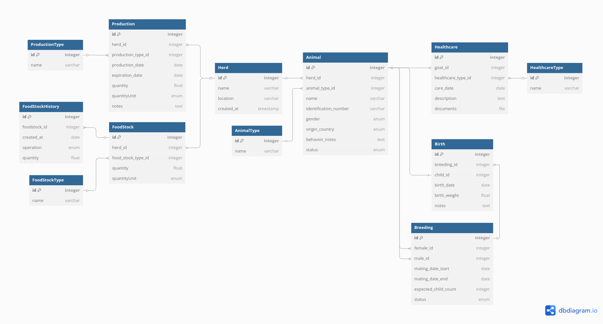

# Goaty-App (API)

Application backend conçue pour la gestion de troupeaux. Elle fournit une interface API robuste pour suivre le bétail, gérer les stocks de nourriture, surveiller les événements de reproduction et de naissance, et enregistrer les soins de santé.

Ce projet est construit avec **Symfony** et tourne dans un environnement **Docker**, en utilisant le stack [symfony-docker](https://github.com/dunglas/symfony-docker) pour un développement rapide et une expérience de production cohérente.

## Table des Matières

- [Fonctionnalités Principales](#fonctionnalités-principales)
- [Prérequis](#prérequis)
- [🚀 Installation Rapide (avec `make`)](#-installation-rapide-avec-make)
- [Installation Manuelle Détaillée](#installation-manuelle-détaillée)
- [Workflow de Développement](#workflow-de-développement)
- [Tests](#tests)
- [PHPUnit](#phpunit)
- [Tests d'API (Bruno)](#tests-dapi-bruno)
- [Structure de l'API](#structure-de-lapi)
- [Modèle de Données](#modèle-de-données)

## Fonctionnalités Principales

1. Métier
*   **Gestion des Troupeaux et des Animaux :** Créez et gérez des troupeaux et suivez les animaux individuels au sein de ces troupeaux.
*   **Cycle de Reproduction :** Suivez l'ensemble du cycle de reproduction, de la saillie à la naissance.
*   **Suivi Sanitaire :** Enregistrez les traitements, les vaccinations et d'autres événements de santé pour chaque animal.
*   **Gestion des Stocks :** Gérez les stocks de nourriture et leur historique d'utilisation.
*   **Suivi de la Production :** Enregistrez les données de production (par exemple, lait, laine) par troupeau.
*   **Authentification JWT :** API sécurisée utilisant des JSON Web Tokens avec des endpoints de rafraîchissement.

2. Programmation
*   **Soft delete :** L'application utilise le package `SoftDeleteable` de `Gedmo`.
*   **Gestion automatique du cache :** Gestion automatique du cache dans `src/Controller/Abstract/AbstractCachedController.php`.
*   **Gestion automatique des tests :** Gestion automatique des tests dans `tests/Func/AbstractApiTestCase.php` avec les helpers dans `tests/Helper`.
*   **Gestion automatique de permissions :** Gestion de la permission des resources dans `src/EventSubscriber/OwnerCheckSubscriber.php`.
*   **Vérification avec les DTO :** Vérification des données utilisateurs avec les DTO dans `src/Dto`.
*   **Utilisation des fichiers de langues :** Les fichiers de langues de l'application se trouvent dans `translations`.

## Prérequis

Avant de commencer, assurez-vous d'avoir installé **Docker** et **Docker Compose** (v2.10+) sur votre système.

- [Instructions d'installation de Docker](https://docs.docker.com/get-docker/)
- Optionnel : `make` pour utiliser les raccourcis.

---

## 🚀 Installation Rapide (avec `make`)

Un `Makefile` est inclus pour automatiser les tâches courantes. C'est la méthode recommandée pour démarrer rapidement.

1.  **Cloner le dépôt**
    ```sh
    git clone https://github.com/Goaty-app/back.git goaty-app-back
    cd goaty-app-back
    ```

2.  **Créer le fichier d'environnement local**
    ```sh
    cp .env .env.local
    ```
    *Assurez-vous de personnaliser les variables dans `.env.local` si nécessaire (par exemple, `DATABASE_URL`).*

3.  **Lancer l'installation complète**
    Cette commande va construire les images Docker, démarrer les conteneurs, installer les dépendances, générer les clés JWT, et mettre en place la base de données avec les fixtures.
    ```sh
    make
    ```
    *(Par défaut, `make` exécute la cible `clean`, qui enchaîne toutes les étapes de configuration.)*

4.  **Accéder à l'application**
    Ouvrez `https://localhost` dans votre navigateur. Vous devrez peut-être accepter le certificat TLS auto-signé.

---

## Installation Manuelle Détaillée

Si vous ne pouvez pas ou ne voulez pas utiliser `make`, suivez ces étapes.

1.  **Cloner le dépôt et créer `.env.local`** (voir étapes 1 et 2 de l'installation rapide).

2.  **Construire et démarrer les conteneurs Docker**
    ```sh
    docker compose build --no-cache
    docker compose up -d --wait
    ```

3.  **Mettre en place la base de données**
    ```sh
    docker compose exec php php bin/console doctrine:schema:update --force
    docker compose exec php php bin/console doctrine:fixtures:load
    ```

4.  **Générer les clés d'authentification JWT**
    ```sh
    docker compose exec php php bin/console lexik:jwt:generate-keypair
    ```

## Workflow de Développement

Utilisez les commandes `make` pour simplifier votre travail quotidien.

| Commande          | Description                                                                                             |
| :---------------- | :------------------------------------------------------------------------------------------------------ |
| `make` ou `make clean` | **Setup complet :** Remet à zéro la BDD, met à jour le schéma, charge les fixtures et vide le cache. Idéal pour un nouveau départ. |
| `make up`         | Démarre tous les conteneurs Docker en arrière-plan.                                                     |
| `make down`       | Arrête et supprime tous les conteneurs.                                                                 |
| `make build`      | Reconstruit les images Docker sans cache.                                                               |
| `make debug`      | Démarre les conteneurs avec le mode débogage Xdebug activé.                                             |
| `make test`       | Prépare la base de données de test et lance la suite de tests PHPUnit.                                  |
| `make fix`        | Formate automatiquement le code selon les standards PSR.                                                |
| `make cache`      | Vide le cache de l'application Symfony.                                                                 |
| `make schema`     | Met à jour le schéma de la base de données.                                                             |
| `make fixtures`   | Charge les données de test (fixtures).                                                                  |

**Commandes utiles non incluses dans `make` :**

*   **Lister les routes de l'API :**
    ```sh
    docker compose exec php php bin/console debug:router
    ```
*   **Valider le schéma Doctrine :**
    ```sh
    docker compose exec php php bin/console doctrine:schema:validate
    ```

## Tests

### PHPUnit

1.  **Configurer l'environnement de test**
    ```sh
    cp .env.local .env.test.local
    ```

2.  **Lancer la suite de tests (Méthode recommandée)**
    Cette commande unique prépare la BDD de test et lance PHPUnit.
    ```sh
    make test
    ```

### Tests d'API (Bruno)

Le répertoire `/bruno` contient une collection complète de requêtes pour tester tous les endpoints de l'API.

1.  **Installer Bruno** : Téléchargez l'application [Bruno](https://www.usebruno.com/).
2.  **Utilisation** : Ouvrez le dossier du projet dans Bruno. Il faut bien activer l'environnement `Goaty-App-Env`.

## Structure de l'API

L'API suit les conventions RESTful.

## Modèle de Données

Le cœur de l'application est centré sur le `Troupeau (Herd)`, qui contient des `Animaux (Animal)`. Chaque `Animal` peut être impliqué dans des événements de `Reproduction (Breeding)`, de `Naissance (Birth)`, de `Soins (Healthcare)` et de `Production`. Les ressources comme `Stock de nourriture (FoodStock)` sont également liées au troupeau.

